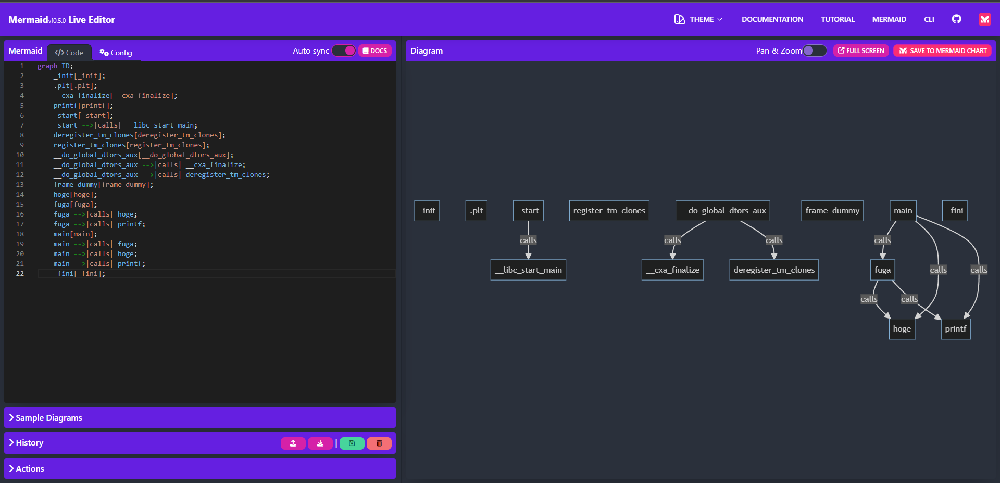

# dep-graph

Displays function caller-callee relations in a ELF file.

# How to use
```
$ cargo run <target_ELF>
```

or

```
$ cargo run <target_ELF> --mermaid
```

First, you have to prepare ELF file and this time I wrote this trashy program written in C:

```C
#include <stdio.h>

int hoge(int a, int b) { return a + b; }

void fuga() { printf("2+3=%d\n", hoge(2, 3)); }

int main() {
  fuga();
  printf("3+4=%d\n", hoge(3, 4));
}
```

Producing ELF file named sample by compile this:
```
$ gcc sample.c -o sample
```

Then, run this application:

```
$ cargo run sample
```

This will make like following output:

```
Function: _start calls <__libc_start_main@GLIBC_2.34>
Function: __do_global_dtors_aux calls <__cxa_finalize@plt>
Function: __do_global_dtors_aux calls <deregister_tm_clones>
Function: fuga calls <hoge>
Function: fuga calls <printf@plt>
Function: main calls <fuga>
Function: main calls <hoge>
Function: main calls <printf@plt>
```

On the other hand, you can create Mermaid format by running:

```
$ cargo run sample --mermaid
```

Copy and paste to [Mermaid Live Editor](https://mermaid.live) make this:


